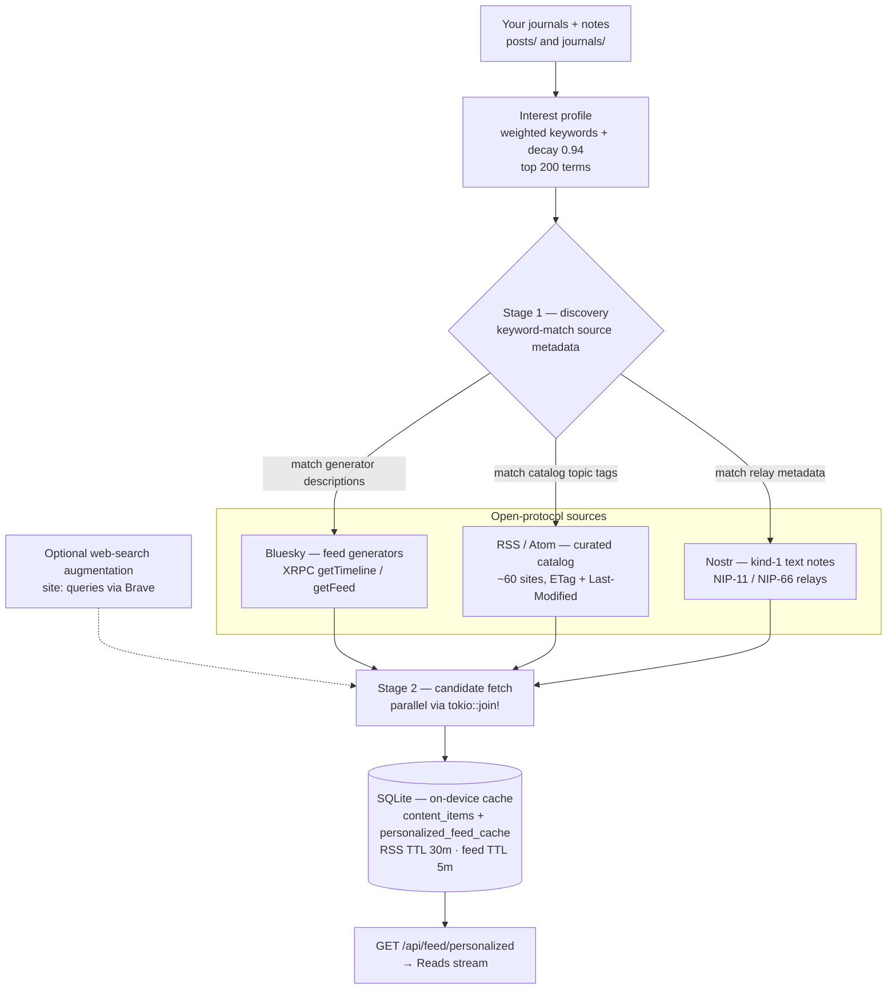
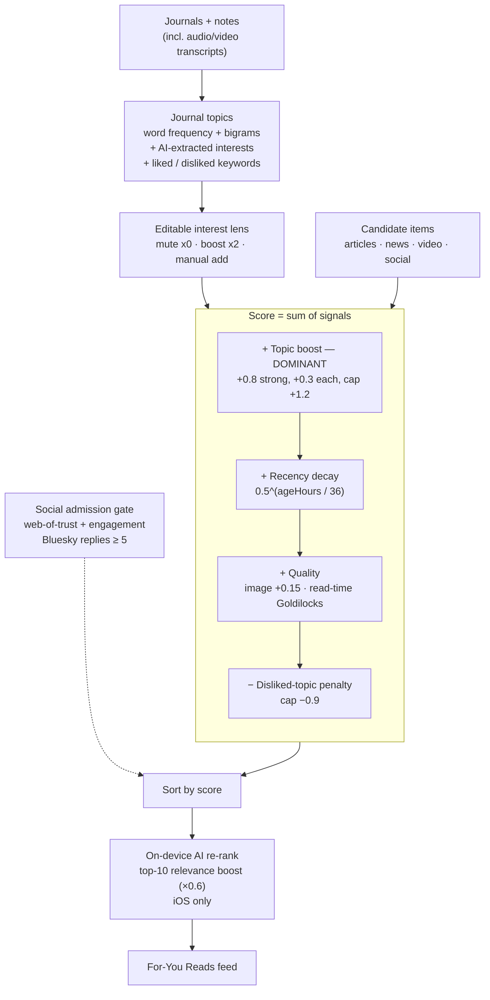
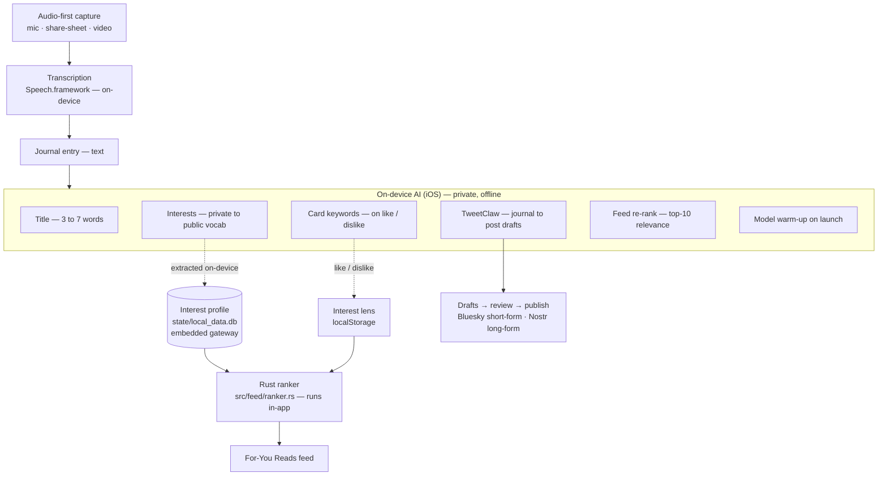

# slowclaw.social

SlowClaw Social is a local-first, **journal-first brain-feeder** — a personal capture and curation app. Your journals are the **lens** that decides what flows back to you.

It is built around **one workspace** and three loops:

1. **Capture** — write journals and notes, or **record audio (the default) or video**. Capture stays on-device: transcription via the native iOS speech bridge, AI via on-device inference (llama.cpp/GGUF).
2. **Feed (journal-driven curation)** — articles, news, and video (incl. YouTube) are ranked by **relevance to your own journals**, not generic popularity. What you've written shapes what you read and watch back. This is the core idea: the journal feeds your mind.
3. **Share / Connect** — distill your thinking into drafts, review them, and publish out to open protocols (Bluesky short-form, Nostr long-form). Discovery of people whose insights resonate flows back into the feed.

You can also:

- generate a workspace feed, todos, events, and clip plans from your own material
- curate personalized Bluesky/Nostr and web/article/video feeds from local interests and cached sources
- keep the core runtime, storage, and AI workflows on your own machine

The binary name is `slowclaw`.

> The authoritative, enforceable vision is [`docs/vision-contract.md`](docs/vision-contract.md).

## How It Works

SlowClaw is built around one idea: **what you write is the lens for what you read back.** The diagrams below show the three engines that make that real — feed sourcing, ranking, and the AI loop. Code references point at the Rust core (`src/`) and the web/Tauri shell (`web/src/`).

### 1. Feed sourcing — where the feed comes from

The **world feed** (`src/feed/mod.rs`, served at `GET /api/feed/personalized`) is assembled from open-protocol sources, never closed silos. Your journals are mined into an **interest profile** that steers *which* sources get fetched (Stage 1) and *which* items rank (Stage 2). The three protocol sources run in parallel; one failing never kills the others.



> **Scope note.** The backend world feed ingests **Bluesky, RSS/Atom, and Nostr** (+ optional web search). The frontend **Reads** stream additionally merges **Hacker News, YouTube/video, and web-of-trust-gated social** posts from on-device caches (`state/nostr.db`, `state/videos.db`) and re-ranks them client-side. Video/YouTube is a first-class *read-only* ingestion source, never a publishing surface.

### 2. Ranking — the journal is the lens

Ranking is **journal-driven**, not popularity-driven. Journal text becomes weighted topics; those topics are the dominant score signal, so a relevant older piece can outrank a generic fresh one. This happens client-side in `web/src/lib/readsRanking.ts`, with an on-device AI re-rank pass on top.



> **Why topics dominate.** A strong journal-topic match (~+1.2) is tuned to beat a near-max recency signal (≤1.0), so evergreen relevance surfaces. With no topics extracted, scoring degrades gracefully to pure recency + quality (cold start). The Rust world-feed ranker (`src/feed/ranker.rs`) uses the same journal-keyword signal plus a source-discovery bonus and source-diversity interleaving. Embeddings exist for **memory recall**, not the feed.

### 3. AI loop — on-device, journal-steered

SlowClaw is iOS-first, so AI runs **on-device** by default. Capture-time intelligence — transcription, titles, post drafts, interest mining, feed re-ranking — goes through `nativeAiChat` (llama.cpp/GGUF in `web/src-tauri/src/inference.rs`) and `transcribeAudio` (Speech.framework in `web/src-tauri/src/transcription.rs`), gated by `isTauriMobileRuntime() && nativeLocalAiStatus?.available`. The iOS app embeds the Rust gateway in-process (bound to `127.0.0.1:42617`), so the personalized feed ranker (`src/feed/ranker.rs`), the feed store, and memory/embeddings all run **inside the app** — there is no separate desktop server to stand up.

The on-device loop writes back into the embedded gateway's feed store: when you save a journal on iOS, on-device AI extracts interest keywords and persists them at `state/local_data.db`, which the Rust ranker then reads back to weight the personalized feed. This is the loop that makes the journal the lens.



> **Two stores, one lens.** Interest keywords (AI-extracted from journals) persist in the embedded gateway's feed store at `state/local_data.db` and feed the Rust ranker. Card keywords (extracted on like / dislike) live client-side in `localStorage` and feed the editable interest lens in `readsRanking.ts`. Both steer what you read back — and both stay on-device.
>
> **Reference pattern.** TweetClaw (post generation) and on-device task/interest extraction in `web/src/App.tsx` are the template for any new AI feature on iOS: gate on `isTauriMobileRuntime() && nativeLocalAiStatus?.available`, request JSON from `nativeAiChat`, parse defensively with retries, log to the AI activity log, and degrade gracefully. Agentic tool-use features (ClawChat, workspace synthesizer) run on the embedded gateway and are reachable on iOS only via desktop QR pairing — they are not part of the default on-device loop. For any new capture or synthesis feature, build the on-device variant first.

## What This Fork Keeps

- Workspace-only file access policy (hard-enforced in app config/policy)
- Local-first desktop/mobile app flow built on the bundled web UI and Tauri shell
- Journals, workspace feed generation, todos, events, transcript/clip planning, and personalized feed surfaces
- CLI + gateway (`/pair`, `/pair/new-code`, `/webhook`, `/health`, `/metrics`)
- Cron scheduling
- `workspace-script <relative/path>` scheduled command support
- PocketBase delivery for cron/heartbeat output
- Gateway-managed local SQLite store for chat, drafts, history, todos, events, and feed metadata
- Local Nostr store at `state/nostr.db` — a persistent, on-device cache of Nostr events, profiles, reactions, replies, and articles, populated by a background ingester (see [Local Nostr Store](#local-nostr-store))
- `memory/` folder structure (unchanged)

## What This Fork Removes

- Full-system access / configurable extra roots (`allowed_roots`)
- External channel integrations (Telegram, WhatsApp, Discord, Slack, etc.)
- Gateway dashboard REST API (`/api/*`), SSE, and WebSocket chat endpoints
- Old dashboard frontend pages and integration UI

## Before You Install (Security)

SlowClaw Social is local-first, but scheduled scripts and agent actions are still real process execution. App-level workspace checks are useful, but not a kernel sandbox.

Read `SECURITY.md` and follow the **Workspace-Only Fork Hardening (Before Install)** section.

Minimum recommendation:

- dedicated OS user
- dedicated workspace directory
- container/VM (preferred) or Linux sandbox backend (`bwrap` / firejail / Landlock)
- restrict network egress unless needed

## Quick Start

### Fastest developer path

If you are working on the app locally, the main entry point is:

```bash
cd web
npm install
npm run tauri dev
```

That starts the React frontend, launches the embedded Rust gateway, and opens the desktop app shell.

### 1. Prerequisites

Required for all local development:

- Rust stable toolchain (`rustc`, `cargo`)
- Node.js 18+ and npm

Required on macOS for the Tauri desktop app:

- Xcode Command Line Tools

  ```bash
  xcode-select --install
  ```

Recommended on macOS for packaging and native Apple builds:

- Full Xcode app from the App Store
- Homebrew

Required for iPhone/iOS development:

- Full Xcode app
- CocoaPods

  ```bash
  brew install cocoapods
  ```

- Rust iOS targets

  ```bash
  rustup target add aarch64-apple-ios x86_64-apple-ios aarch64-apple-ios-sim
  ```

### 2. Clone and install dependencies

```bash
git clone https://github.com/zanynik/slowclaw.social.git
cd slowclaw.social
cd web
npm install
cd ..
```

### 3. Run the macOS desktop app in dev mode

```bash
cd web
npm run tauri dev
```

What this does:

- runs the Vite frontend dev server
- builds the Rust Tauri host
- starts the embedded gateway automatically
- opens the desktop app window

The frontend dev server is configured at `http://localhost:1420`, but in normal use you just launch the Tauri app window.

### 4. Build distributable desktop artifacts

To build the production desktop app and bundle outputs such as `.app` and `.dmg` on macOS:

```bash
cd web
npm run tauri -- build
```

Bundle outputs are written under:

- `web/src-tauri/target/release/bundle/`

### 5. Run the iPhone app in dev mode

First-time setup:

```bash
cd web
npm run tauri:ios:init
```

Then run on simulator or device:

```bash
cd web
npm run tauri:ios:dev
```

Notes:

- You will likely need to choose a signing team in Xcode for device builds.
- The generated iOS project lives under `web/src-tauri/gen/apple/`.
- The iOS app uses the same Rust/Tauri codebase and web frontend as the desktop app.

### 6. CLI / gateway-only development

If you only want the Rust binary and gateway without the Tauri shell:

```bash
cargo build --release
./target/release/slowclaw gateway
```

Recommended for full scheduling + chat worker runtime:

```bash
./target/release/slowclaw daemon
```

The default gateway bind is:

- `http://127.0.0.1:42617/`

### 7. Pair and send a webhook prompt (optional)

If pairing is enabled, use the startup pairing code:

```bash
curl -X POST http://127.0.0.1:42617/pair -H 'X-Pairing-Code: <code>'
```

Then send prompts:

```bash
curl -X POST http://127.0.0.1:42617/webhook \
  -H 'Authorization: Bearer <token>' \
  -H 'Content-Type: application/json' \
  -d '{"message":"hello"}'
```

### Workspace path recommendation (journals, media, artifacts)

Use a stable config/workspace root so files are easy to find:

```bash
export ZEROCLAW_CONFIG_DIR="$HOME/.zeroclaw"
```

Avoid pointing `ZEROCLAW_WORKSPACE` at temporary directories (`/tmp`, OS temp folders).  
By default, temp workspace overrides are ignored unless you explicitly opt in with:

```bash
export ZEROCLAW_ALLOW_TEMP_WORKSPACE=1
```

### 8. Generate a new pairing code without logging out existing clients

Use this when Mac is already paired and you want to pair phone too.

```bash
./target/release/slowclaw pair new-code --token '<existing_bearer_token>'
```

You can also set:

```bash
export ZEROCLAW_GATEWAY_TOKEN='<existing_bearer_token>'
./target/release/slowclaw pair new-code
```

Notes:

- Existing paired sessions remain valid.
- `config.toml` stores hashed tokens, not plaintext bearer tokens.
- You can copy the current token from the web UI: Profile -> Gateway & App Settings -> Show Token / Copy Token.

## Local Store Migration

On first gateway boot, SlowClaw initializes `state/local_data.db` and automatically checks for
legacy PocketBase data directories (including `Application Support/.../pocketbase/pb_data`).

If found, it imports legacy records (`chat_messages`, `drafts`, `post_history`,
`journal_entries`, `media_assets`, `artifacts`) before serving traffic.

Optional override for migration source:

```bash
ZEROCLAW_LEGACY_POCKETBASE_DATA_DIR=/absolute/path/to/pb_data ./target/release/slowclaw gateway
```

## Local Nostr Store

Under the Tauri (desktop + iOS) shell, SlowClaw runs a background ingester that maintains a persistent, on-device cache of Nostr events in a dedicated SQLite database at `state/nostr.db` (kept separate from the gateway's `state/local_data.db` to avoid WAL contention and allow independent reset).

- events, profiles (kind 0), reactions (kind 7), replies, and long-form articles (kind 30023) are cached with an inverted tag index (`#e`, `#p`, `#t`, `#d`, `#a`) for fast local queries
- the `npub` for each author is precomputed once at ingest, retiring the per-render bech32 encode the browser path used to do
- the web UI reads the feed, profiles, reactions, replies, and articles from the local store via Tauri IPC instead of re-hitting relays on every load — the browser-direct WebSocket path is retained as the standalone web/demo fallback
- publishing (notes, reactions, replies) signs with the user's keys and goes out through the persistent relay client; the own event is ingested immediately so it appears in the UI without waiting for a round-trip

The store file lives strictly under `workspace_dir/state/`, honoring the workspace-only file policy. Resetting it (delete `state/nostr.db`) does not affect any other app data.

## Scheduling Workspace Scripts

Use the cron CLI and the `workspace-script` command form.

Example script (must live inside the workspace):

```bash
mkdir -p scripts
cat > scripts/ping.sh <<'SH'
#!/usr/bin/env bash
set -euo pipefail
date > ./last-run.txt
SH
chmod +x scripts/ping.sh
```

Schedule it every 15 minutes:

```bash
./target/release/slowclaw cron add '*/15 * * * *' 'workspace-script scripts/ping.sh'
```

Notes:

- Path must be workspace-relative.
- Keep scripts small and reviewed.
- Prefer `workspace-script` over long shell chains.
- App policy is not a substitute for OS sandboxing.

## Web UI (Merged From `phone_app_mysky`)

The bundled UI is now a local-first React app backed by gateway APIs (replacing the old dashboard).

To rebuild the UI bundle:

```bash
cd web
npm install
npm run build
```

The gateway serves static assets under `/_app/` and uses SPA fallback for `/`.

Important:

- The web bundle is embedded in the Rust binary at compile time.
- After `web` changes, rebuild both UI and binary:

```bash
cd web && npm run build
cd .. && cargo build --release
```

## Tauri v2 Mobile App (Scaffolded)

This repo now includes a Tauri v2 scaffold at:

- `web/src-tauri/`

Included:

- secure credential bridge commands (`get_secret`, `set_secret`, `delete_secret`) backed by OS keyring
- `tauri.conf.json`
- default capability file
- npm scripts for iOS/Android init + dev

### Prerequisites (macOS/iOS)

Install before running mobile commands:

- Xcode (full app)
- Rust iOS targets:
  - `rustup target add aarch64-apple-ios x86_64-apple-ios aarch64-apple-ios-sim`
- CocoaPods:
  - `brew install cocoapods`

### First-time iOS setup

```bash
cd web
npm install
npm run tauri:ios:init
```

### Run on iOS simulator/device

```bash
cd web
npm run tauri:ios:dev
```

### Notes

- Gateway build still uses `npm run build` (`/_app/` asset base) for embedded Rust gateway UI.
- Tauri build uses `npm run build:tauri` (`./` asset base) and is wired in `src-tauri/tauri.conf.json`.
- After `tauri ios init`, open the generated Xcode project and set:
  - camera + microphone usage descriptions
  - local network usage description
  - ATS exceptions for local HTTP testing if you keep laptop gateway on plain `http://`.

### Mobile Safari note (LAN HTTP)

iPhone Safari on `http://<LAN-IP>:<port>` may not expose live `getUserMedia` recording APIs.
In this fork, Audio/Video buttons fall back to file/capture picker automatically when live recording is unavailable.

## Minimal Route Surface (Gateway)

Exposed routes now:

- `GET /health`
- `GET /metrics`
- `POST /pair`
- `POST /pair/new-code`
- `POST /webhook`
- `GET /api/chat/messages`
- `POST /api/chat/messages`
- `POST /api/media/upload`
- `POST /api/journal/text`
- `GET /api/library/items`
- `GET /api/library/text`
- `POST /api/library/save-text`
- `GET /api/media/{path}`
- `GET /` and `GET /_app/*` (static UI)

Removed from the gateway surface in this fork:

- `/api/events`
- `/ws/chat`
- external channel webhook endpoints (`/whatsapp`, `/linq`, `/wati`, `/nextcloud-talk`, etc.)

## Project Layout (Important Directories)

- `memory/` — agent memory structure (kept intact for future use)
- `pb_data/` — legacy PocketBase runtime data (auto-import source)
- `pb_migrations/` — legacy PocketBase migrations
- `pocketbase/` — legacy PocketBase binary/schema assets
- `web/` — bundled web UI source/build
- `scripts/` — workspace scripts you schedule

## Validation Notes

Recommended local checks:

```bash
cargo check
git diff --check
```
