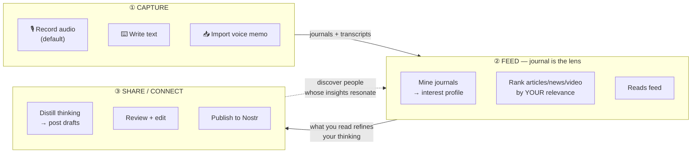
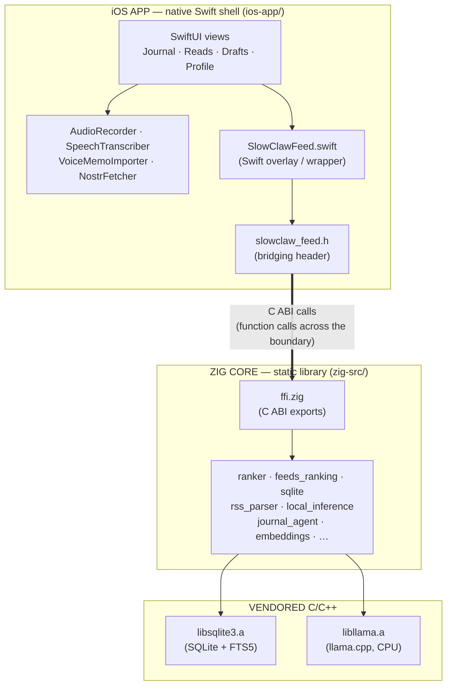
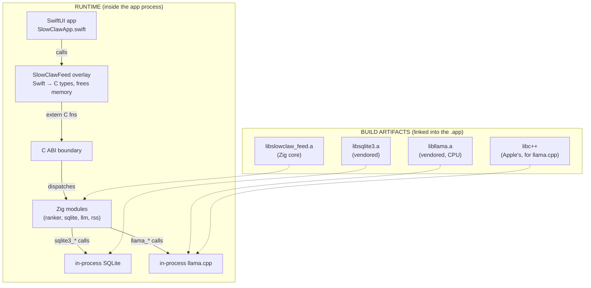
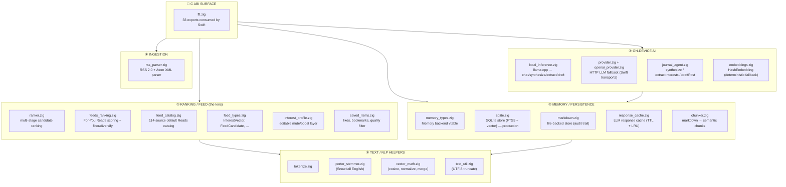
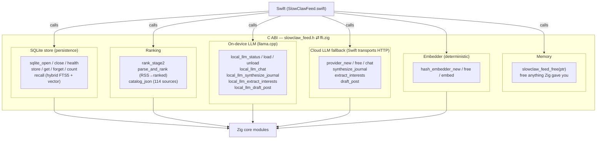
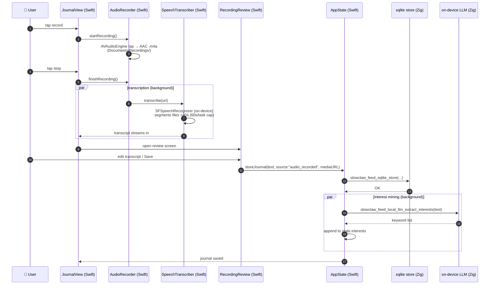
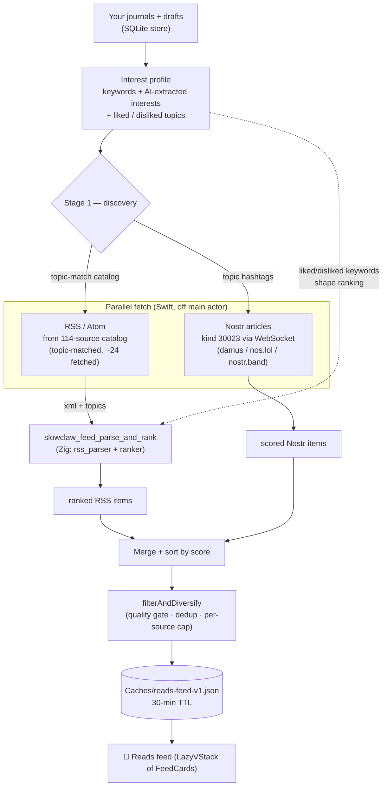
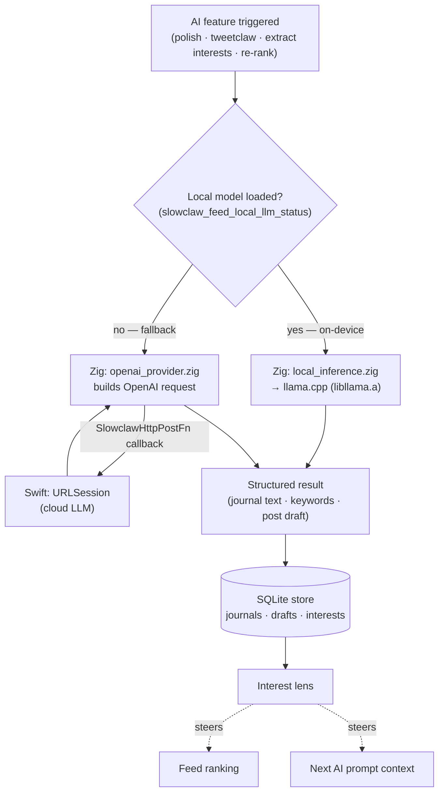
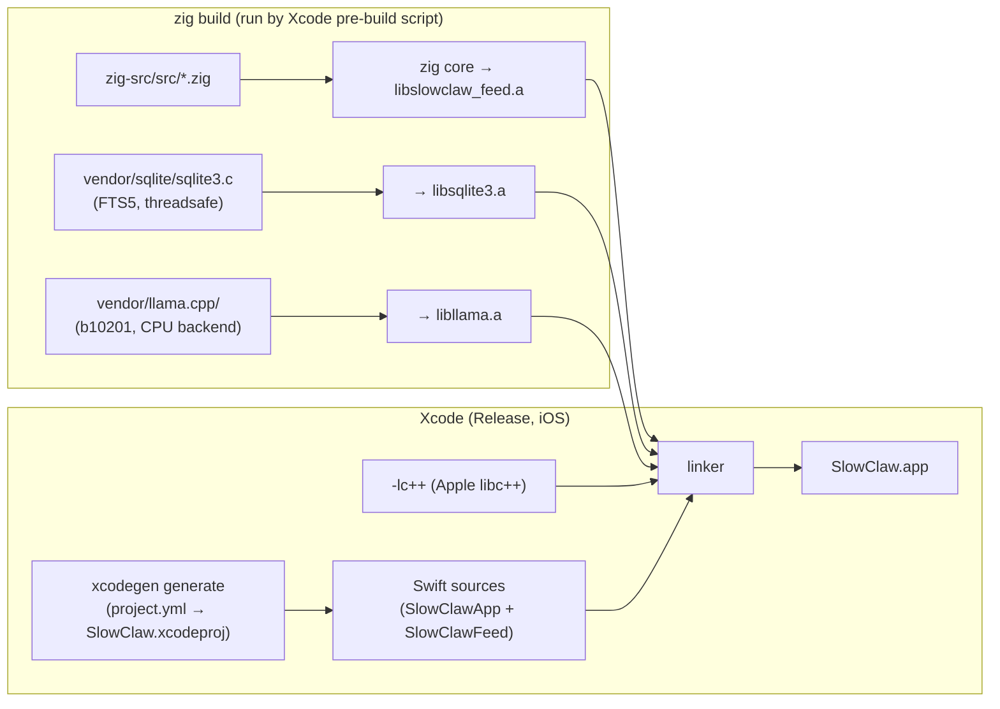

# SlowClaw Social

> **Local-first, journal-first brain-feeder.** Your journals are the lens that decides what flows back to you. An iOS app built from a **Zig core** + a **native Swift shell**. No Rust, no Tauri, no React, no web bundle, no server.

---

## Table of contents

- [What it is (the 30-second version)](#what-it-is-the-30-second-version)
- [The three loops (product thesis)](#the-three-loops-product-thesis)
- [Architecture at a glance](#architecture-at-a-glance)
- [Diagram 1 — The two-layer architecture](#diagram-1--the-two-layer-architecture)
- [Diagram 2 — The Zig core (modules)](#diagram-2--the-zig-core-modules)
- [Diagram 3 — The C ABI contract (Zig ↔ Swift)](#diagram-3--the-c-abi-contract-zig--swift)
- [Diagram 4 — Capture loop (audio → journal)](#diagram-4--capture-loop-audio--journal)
- [Diagram 5 — Feed loop (journal-driven curation)](#diagram-5--feed-loop-journal-driven-curation)
- [Diagram 6 — AI loop (on-device, journal-steered)](#diagram-6--ai-loop-on-device-journal-steered)
- [Diagram 7 — How a build happens](#diagram-7--how-a-build-happens)
- [Diagram 8 — TestFlight CI pipeline](#diagram-8--testflight-ci-pipeline)
- [Where things live (repo map)](#where-things-live-repo-map)
- [Quick start (build the app)](#quick-start-build-the-app)
- [Working on the Zig core](#working-on-the-zig-core)
- [Releasing to TestFlight](#releasing-to-testflight)
- [Guidance for further development](#guidance-for-further-development)
- [Vision & governance](#vision--governance)

> **This README is the single source of truth.** The sub-READMEs in [`zig-src/`](zig-src/README.md) and [`ios-app/`](ios-app/README.md) cover build/link details for their layer; if anything there disagrees with this file, this file wins.

---

## What it is (the 30-second version)

SlowClaw Social is an iOS app that helps you **think better by writing**. Three things happen, all on your phone:

1. You **capture** — mostly by recording audio (the default), sometimes by typing.
2. What you write becomes a **lens** — the app mines your journals for your interests.
3. That lens steers **what you read back** (articles, news, video) and helps you **turn your thinking into posts**.

Everything runs **on-device**: transcription via iOS Speech, the AI via a local llama.cpp model. Your journals and your lens never leave your phone.

---

## The three loops (product thesis)



The arrow that matters most: **your journals → the feed ranking**. That is the differentiator. A relevant older piece can outrank a generic fresh one, because what *you* have written is the dominant scoring signal.

---

## Architecture at a glance

Two layers. Nothing else.



- The **Swift shell** owns everything visual + all native iOS APIs (microphone, speech, network, files). It never reaches into Zig internals.
- The **Zig core** owns everything computational: ranking, persistence, RSS parsing, on-device LLM inference. It only exposes a small C ABI.
- The **vendored C/C++** (SQLite, llama.cpp) are linked as separate static archives — the Zig core calls into them.

The *only* bridge between Swift and Zig is the C ABI declared in `slowclaw_feed.h`. Understanding that contract (Diagram 3) is the key to understanding the whole system.

---

## Diagram 1 — The two-layer architecture

A more detailed view of how the layers fit together at build time and runtime.



**Memory rule (critical):** when Zig returns a string or buffer, **Swift frees it** by calling `slowclaw_feed_free`. When Swift passes a string in, Swift owns it. Get this wrong and you get a use-after-free or a leak. This is the #1 thing to internalize before touching the FFI.

---

## Diagram 2 — The Zig core (modules)

The core is organized into five responsibility groups. Each box is a `.zig` file under `zig-src/src/`.



**What each group does, in one line:**

| Group | Job |
|---|---|
| **① Ranking / Feed** | Decide what you see. Turns your interests into scores; ranks articles, news, video. |
| **② Memory / Persistence** | Remember everything. SQLite is the production store (journals, drafts, likes, interests, cache). |
| **③ On-device AI** | Run the LLM locally. `local_inference.zig` is the on-device path; `provider.zig` is the cloud fallback. |
| **④ Ingestion** | Pull in external content. `rss_parser.zig` parses feeds; the catalog lists the 114 default sources. |
| **⑤ Text / NLP helpers** | The math behind ranking: tokenize, stem, compare vectors. |

> The detailed module map (responsibilities, port provenance, divergences) is in [`zig-src/README.md`](zig-src/README.md).

---

## Diagram 3 — The C ABI contract (Zig ↔ Swift)

This is the **most important diagram** — it is the entire interface between the two layers. Every box is a group of C functions declared in `slowclaw_feed.h` and implemented in `ffi.zig`.



**Conventions (the whole contract in 4 rules):**

| Rule | Detail |
|---|---|
| **Strings in** | Caller-owned `(ptr, len)`. Zig does not free. |
| **Strings/buffers out** | Zig-allocated, returned as `SlowclawString {bytes, len}`. **Caller frees** via `slowclaw_feed_free` (or the matching `_result_free`). |
| **Status codes** | `c_int`: `0` OK, `-1` invalid arg, `-2` OOM, `-3` internal, `-4` embedder mismatch. |
| **Handles** | Opaque pointers (`SlowclawSqlite*`, `SlowclawProvider*`, `SlowclawHashEmbedder*`). Create → use → destroy with the matching `_free`/`_close`. |

> When you add a new export to `ffi.zig`, you **must** also add a `_ = &ffi.your_new_fn;` line to the `comptime` retention block in `root.zig` (Zig 0.16's lazy compilation drops otherwise-unreferenced exports from the static archive — a missing line = "undefined symbol" at the iOS link step).

---

## Diagram 4 — Capture loop (audio → journal)

What happens when you press record, stop, and save. This is the **primary** capture mode (audio-first).



**Two parallel import paths** (no review gate — auto-stored):
- **Voice-memo share-sheet import** → iOS may deliver through its read-only `Documents/Inbox/`; `VoiceMemoImporter` copies into writable `Documents/ImportedAudio/`, then the serial worker transcribes and stores with `source:"audio_imported"`.
- **Text compose** → `TextComposeSheet` stores with `source:"text"`.

The journal entry, its transcript, and the audio file path (`media_url`) all land in the same SQLite store — that's what the feed ranker and the AI both read from next.

---

## Diagram 5 — Feed loop (journal-driven curation)

How the Reads tab decides what to show. The key idea: **your journals steer both *which* sources are fetched and *how* items are ranked.**



**Why your journal matters here:** the `topics` JSON passed into `parse_and_rank` is built from your interest profile. A strong topic match (~+1.2) is tuned to beat a near-max recency signal (≤1.0), so an evergreen relevant piece can outrank a fresh generic one. With no topics extracted, scoring degrades gracefully to recency + quality (cold start).

**Nostr details:** the app fetches long-form articles (`kind 30023`) from three relays, filters out spam/non-English/capped at 2 per author, scores by recency + topic boost, and builds `highlighter.com/a/{naddr}` links via a from-scratch bech32 encoder (`Nip19.swift`). (habla.news went offline — the domain serves a Vercel DEPLOYMENT_NOT_FOUND — so article links moved to Highlighter, a living long-form Nostr reader that resolves the same naddr URLs server-side.)

---

## Diagram 6 — AI loop (on-device, journal-steered)

Every AI feature routes **local-first**: if a GGUF model is loaded, it runs in-process via llama.cpp; otherwise it falls back to an OpenAI-compatible HTTP provider (with Swift providing the URLSession transport through a C callback).



**The local model lifecycle** (managed in Profile → On-Device AI card):
1. **Download** a Gemma GGUF from HuggingFace (`LocalModelStore`, ~2.1–2.5 GB) into `Documents/Models/`. The Q4 audio option is the same Q4 text GGUF plus a separate ~1 GB audio projector—not a second text model. The row shows determinate progress immediately; iOS owns the background transfer, and SlowClaw persists the selected preset so a relaunch automatically reattaches the bar or safely retries a force-quit transfer.
2. **Activate** → `slowclaw_feed_local_llm_load(path)` — Zig loads it into llama.cpp. Context is capped at 1536 tokens to stay inside the default per-app memory budget.
3. **Use** — every `aiChat` / `aiSynthesize` / `aiExtractInterests` / `aiDraftPost` in `AppState` checks `localLLM.loaded` first.
4. **Unload** → `slowclaw_feed_local_llm_unload()` frees the RAM.

> **TweetClaw** (the Drafts tab) is the reference AI feature: pick an unprocessed journal → chunk it → `aiChat(system: tweetClawPrompt, message: chunk)` → acceptance gate (11–399 chars) → store as a draft. Copy this pattern for any new AI feature.

---

## Diagram 7 — How a build happens

There are **three** static archives and the build wires them together. The Xcode project's pre-build script runs `zig build` automatically — you usually don't run it by hand.



**Two target paths** (the pre-build script picks automatically):
- **Simulator** (`iphonesimulator`) → `zig build -Dtarget=aarch64-ios-sim -Doptimize=ReleaseFast`
- **Device** (`iphoneos`) → `zig build -Dtarget=aarch64-ios -Doptimize=ReleaseFast`

**Why `-Doptimize=ReleaseFast` (not ReleaseSafe)?** Zig 0.16's `std.debug` calls `_dyld_get_image_header_containing_address`, which is unavailable on iOS. ReleaseFast drops the safety-panic stack-walk path that references it. (Fixed upstream in Zig 0.17-dev; see [`zig-src/README.md`](zig-src/README.md) for the full set of known iOS link workarounds.)

---

## Diagram 8 — TestFlight CI pipeline

The single publish path: `.github/workflows/pub-testflight-zig.yml`. Manual trigger (`workflow_dispatch`) — it does **not** auto-run on push right now.

```mermaid
flowchart TB
    START([“Manual: Run workflow”]) --> CO["checkout"]
    CO --> ZI["install Zig 0.16.0<br/>→ tools-zig/zig"]
    ZI --> XG["install XcodeGen"]
    XG --> ZB["zig build -Dtarget=aarch64-ios<br/>-Doptimize=ReleaseFast"]
    ZB --> GUARD{"archive guards pass?<br/>nm -a (alignment)<br/>nm -u | grep __hash_memory<br/>(must be ABSENT)"}
    GUARD -->|"no"| FAILBUILD([“❌ fail fast<br/>(would crash at launch)”])
    GUARD -->|"yes"| GENP["xcodegen generate<br/>→ SlowClaw.xcodeproj"]
    GENP --> ASC["App Store Connect API<br/>issue distribution cert<br/>+ provisioning profile"]
    ASC --> KEY["set up signing keychain<br/>import cert + profile"]
    KEY --> ARCH["xcodebuild archive<br/>(Release, generic/iOS)"]
    ARCH --> EXP["xcodebuild -exportArchive<br/>→ SlowClaw.ipa"]
    EXP --> UP["xcrun altool --upload-app<br/>→ TestFlight"]
    UP --> DONE([“✅ in TestFlight”])
    UP -.->|"always"| CLEAN["delete signing keychain<br/>+ ~/.appstoreconnect"]
```

**The four things most likely to fail (watch list):**

| Stage | What breaks | Symptom |
|---|---|---|
| **Zig build** | toolchain regression, libc++ header fallback | compile error, or the `__hash_memory` guard trips |
| **ASC issuance** | API outage, rate limit, bad `.p8` secret | step 7 throws |
| **xcodebuild archive** | link error from a dropped FFI export, missing archive | "undefined symbol for architecture arm64" |
| **altool upload** | duplicate build number, expired key, missing privacy manifest | upload rejected |

**Required secrets** (repo-level, names only): `APP_STORE_CONNECT_ISSUER_ID`, `APP_STORE_CONNECT_KEY_ID`, `APP_STORE_CONNECT_PRIVATE_KEY`, `APPLE_DEVELOPMENT_TEAM` (variable preferred).

---

## Where things live (repo map)

```
slowclaw.social/
├── zig-src/                # the Zig core (the engine)
│   ├── build.zig           # build graph: 3 static archives + test steps
│   ├── build.zig.zon       # package manifest (no external deps)
│   ├── src/                # ffi, ranker, feeds_ranking, sqlite, markdown,
│   │                       #   embeddings, chunker, local_inference,
│   │                       #   rss_parser, feed_catalog, journal_agent, …
│   ├── vendor/sqlite/      # vendored SQLite 3.46 amalgamation
│   └── vendor/llama.cpp/   # vendored llama.cpp (b10201, CPU backend)
├── ios-app/                # the native Swift shell
│   ├── project.yml         # XcodeGen spec (SlowClaw.xcodeproj is gitignored)
│   ├── SlowClawApp/        # SwiftUI app + audio + speech + Nostr fetch
│   │   ├── SlowClawApp.swift       # AppShell + AppState + all tab views
│   │   ├── AudioRecorder.swift     # m4a recording, pause/resume, levels
│   │   ├── SpeechTranscriber.swift # on-device SFSpeech (segments long audio)
│   │   ├── VoiceMemoImporter.swift # share-sheet import, serial worker
│   │   ├── NostrFetcher.swift      # WebSocket article fetch + filter/score
│   │   └── Nip19.swift             # bech32 naddr encoder
│   └── SlowClawFeed/       # Swift package wrapping the C ABI
│       ├── Sources/SlowClawFeed/SlowClawFeed.swift   # Swift overlay
│       └── include/slowclaw_feed.h                   # C ABI contract
├── docs/README.md          # docs entry point (slim)
├── .github/workflows/
│   ├── pub-testflight-zig.yml   # the ONLY publish path
│   └── workflow-sanity.yml      # YAML lint on workflow changes
├── README.md               # ← you are here (single source of truth)
├── AGENTS.md               # agent engineering protocol
├── LICENSE-APACHE
└── LICENSE-MIT
```

**Local-only (gitignored):** `tools/zig/` (locally downloaded Zig toolchain, ~177 MB), `zig-src/.zig-cache/`, `zig-src/zig-out/`, `ios-app/SlowClaw.xcodeproj/`.

---

## Quick start (build the app)

Requires macOS. The iOS app cannot be built on Windows or Linux.

**Prerequisites:**
- **Xcode** (full app) + Command Line Tools
- **XcodeGen** — `brew install xcodegen`
- **Zig 0.16.0** — from <https://ziglang.org/download/0.16.0/>, placed on `PATH` or under `tools/zig/` (gitignored)

**Build and run:**
```bash
cd ios-app
xcodegen generate         # regenerates SlowClaw.xcodeproj from project.yml
open SlowClaw.xcodeproj   # pick a simulator/device target and Run
```

The Xcode pre-build script runs `zig build` automatically for the right target, so editing Zig source and re-running in Xcode picks up the changes immediately.

---

## Working on the Zig core

The core has its own test suite — run it before pushing.

```bash
cd zig-src
zig build                  # emits zig-out/lib{slowclaw_feed,sqlite3,llama}.a
zig build test             # libc-free unit tests
zig build test-ffi         # C ABI round-trip tests
zig build test-sqlite      # SQLite memory backend tests
zig build test-markdown    # Markdown memory backend tests
zig build test-response-cache
SLOWCLAW_TEST_GGUF=/path/to/model.gguf zig build test-local-llm   # on-device LLM smoke
SLOWCLAW_TEST_AUDIO_GGUF=/path/to/model.gguf SLOWCLAW_TEST_MMPROJ=/path/to/mmproj.gguf SLOWCLAW_TEST_PCM_F32=/path/to/mono-16k-f32.raw zig build test-local-audio
```

For the full module map, the C ABI surface, the build graph, and the known iOS-specific link workarounds, see [`zig-src/README.md`](zig-src/README.md).

---

## Releasing to TestFlight

1. Push your changes to `main`.
2. Go to **GitHub → Actions → "Publish iOS TestFlight (Zig)" → Run workflow**.
3. Watch the run. The diagram above ([Diagram 8](#diagram-8--testflight-ci-pipeline)) shows the stages and the watch list.

The workflow is currently **manual-only** (`workflow_dispatch`). To re-enable automatic builds on every push to `main`, uncomment the `push:` block at the top of `.github/workflows/pub-testflight-zig.yml`.

> **Agents must never trigger this workflow automatically** — see [`AGENTS.md`](AGENTS.md) §6.1.2. TestFlight builds cost real money (macOS runners) and consume Apple signing-certificate slots. Triggering is a human decision.

---

## Guidance for further development

**The golden rules (read these before opening a PR):**

1. **The C ABI is the only bridge.** Swift talks to Zig only through `slowclaw_feed.h`. Never reach into Zig internals from Swift, and never have Zig call back into Swift except through the documented `SlowclawHttpPostFn` callback.
2. **When you add an FFI export**, update **four** places in lockstep: `ffi.zig` (impl) → `root.zig` (retention line) → `slowclaw_feed.h` (declaration) → `SlowClawFeed.swift` (wrapper). Miss the `root.zig` line and the iOS link breaks.
3. **Memory ownership is mandatory.** Zig-allocated buffers must be freed by Swift via `slowclaw_feed_free` (or the matching `_result_free`). Status codes: `0` OK, negative = error.
4. **Default to on-device AI.** New AI features should check `localLLM.loaded` first and use `local_inference.zig`; fall back to the HTTP provider only when no model is loaded. TweetClaw (Drafts tab) is the reference pattern.
5. **Keep the journal as the lens.** New ranking/curation surfaces must be journal-driven. The product pipeline is: capture → transform → curation → draft review → open publishing/ingestion.
6. **Prefer proven patterns over novelty.** Scope every feature through Proven → Better → New (see [`AGENTS.md`](AGENTS.md) §3.10). Don't reinvent the three loops — extend them.
7. **One concern per commit.** Conventional-commit messages (`feat(zig):`, `feat(ios):`, `fix(zig):`, `docs:`). Commit and push to a non-`main` branch; the human decides when to release.

Full engineering protocol, risk tiers, and validation matrix: [`AGENTS.md`](AGENTS.md).

---

## Vision & governance

- **Vision contract:** [`docs/vision-contract.md`](docs/vision-contract.md) (where present) is the authoritative statement of the three-loops thesis. When this README and the vision contract conflict, the vision contract wins.
- **Open protocols preferred:** Nostr, RSS, Atom for ingestion and publishing. No closed-platform lock-in for core surfaces.
- **Read-only ingestion:** Video/YouTube is a first-class *ingestion* source; the user's own content and publishing stay open-protocol-bound.
- **License:** Apache-2.0 OR MIT (dual-licensed).
